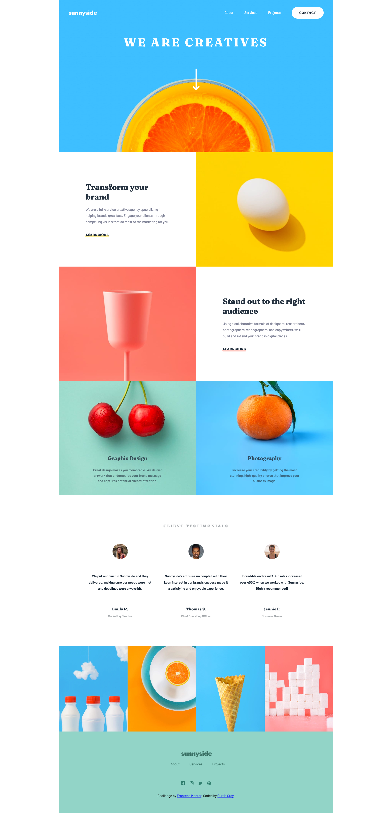

# Frontend Mentor - Sunnyside agency landing page solution

This is a solution to the [Sunnyside agency landing page challenge on Frontend Mentor](https://www.frontendmentor.io/challenges/sunnyside-agency-landing-page-7yVs3B6ef).

## Overview

This project was made to showcase my ability to recreate a pixel perfect web design.

### The challenge

Users should be able to:

- View the optimal layout for the site depending on their device's screen size
- See hover states for all interactive elements on the page

### Screenshot

### Links

- Live Site URL: [Here](https://curtisgry.github.io/sunnyside-agency/)

## My process

I built this page with the reference design images and no design files. I outlined each section using the BEM methodology. There was a lot of tweaking numbers for some parts to get it to match exactly with the reference but in the end I feel the attention to detail shows in the final outcome.

### Built with

- Semantic HTML5 markup
- SASS
- Flexbox

## Author

- Website - [Curtis Gray](https://www.curtisgray.dev)
- LinkedIn - [LinkedIn](https://www.linkedin.com/in/curtis-gray/)
